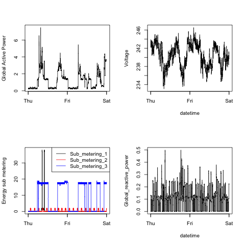

# Are you grading this submission...please read...
## Exploratory Data (exdata-008) Course Project #1

## Running The Code
* If you are using the src files without cloning, make sure:
  * You create a plt folder that exists exists at a level higher than the code `mkdir ../plt` 
  * You NEED the `src/helper.r` file in addition to the four `src/plot[1-4].r` 
    * Future feature could be to include folder creation 
* Clone the repo and run `src/plot[1-4].r`
  * These files rely on the `src/helper.r` file which does all the heavy lifting to get and clean the data
* The entire project relies on just two add on packages that are auto-installed if missing
  * <a href="http://cran.r-project.org/web/packages/sqldf/">sqldf</a> - for efficent retrival of data from large files
  * <a href="http://cran.r-project.org/web/packages/lubridate/">lubridate</a> - for date/time manipulations


## Project Details
Replicate 4 Plots using publicly available data from
the <a href="http://archive.ics.uci.edu/ml/">UC Irvine Machine
Learning Repository</a>. Specifically using the "Individual household electric power consumption Data Set" which is available on the coursera course web site.

The following is heavily borrowed/modified from the orginal assignment source: 

* <b>Dataset</b>: <a href="https://d396qusza40orc.cloudfront.net/exdata%2Fdata%2Fhousehold_power_consumption.zip">Electric power consumption</a> [20Mb]
* <b>Description</b>: Measurements of electric power consumption in
one household with a one-minute sampling rate over a period of almost
4 years. Different electrical quantities and some sub-metering values
are available.

* <b>Variables</b>: The descriptions of the 9 variables in the dataset can be located
at the <a href="https://archive.ics.uci.edu/ml/datasets/Individual+household+electric+power+consumption">UCI
web site</a>


## Loading the data 

The assignment description warns:
* The <b> dataset has 2,075,259 rows and 9 columns</b>. First
calculate a rough estimate of how much memory the dataset will require
in memory before reading into R. 

So, I decided to only read in the rows that I needed into a dataframe using the <a href="http://cran.r-project.org/web/packages/sqldf/">sqldf package</a>

In order to filter our targeted data - the where clause in the sql-like statement focuses on the "Date" variable ("m/d/yyyy" format  NOT "mm/dd/yyyy" as claimed</b>). Specifically we're given two dates to select, and rather than doing extra transformations we can treat them as strings and check equivalence (faster than determining within a range).

So, assuming we open a file handle with the needed data set:
A sqlquery is generated with the two dates and a data frame is the result of the query, with a few extra parameters passes in to handle the header and seperator:


```R
 sqlstatement <- sprintf("select * from fhandle where Date = '%s' or Date = '%s'", sDate, eDate) 
    tdf <- sqldf(sqlstatement, file.format = list(header=TRUE, sep = ";"))
```


## The Plots 
* In each section the requested plot is followed by the one created
* The plots generated in this assignment are in the "plt" directory

### Plot 1 

  

### Plot 2

  


### Plot 3

  


### Plot 4

  

